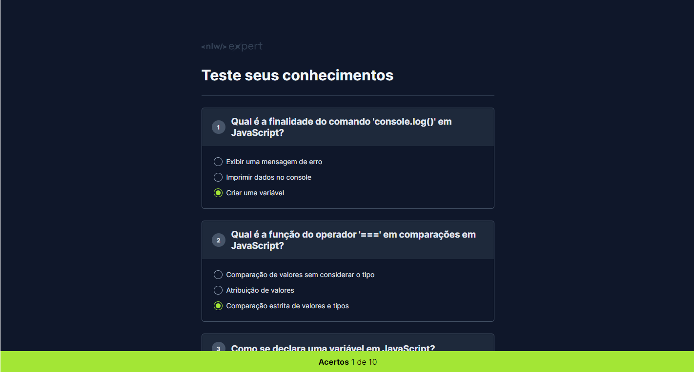

# NLW Expert HTML+CSS+JS

<p align="center">
   
</p>

## 🎯 Objetivo

- Desenvolvido um Quiz que carrega dinamicamente as perguntas e respostas a partir de uma lista apresentando a quantidade de acertos e questões. A lista pode ser gerada conforme o tema de sua preferência a partir de um prompt no chatGPT.

## ⚒ Linguagens e Ferramentas

- HTML5
- CSS3
- JavaScript
- chatGPT

## 💡 Aprendizados

- HTML
  - [`<template>`](https://developer.mozilla.org/en-US/docs/Web/HTML/Element/template): é usada para armazenar algum conteúdo que ficará oculto quando a página for carregada, sendo exibida via Javascript.
- JavaScript
  - [`Set()`](https://developer.mozilla.org/en-US/docs/Web/JavaScript/Reference/Global_Objects/Set): é um conjunto utilizado para criar novas estruturas de dados (objetos). É possível adicionar ou tirar dados dele, porém nunca é possível repetir uma mesma informação.
  - [`cloneNode(true)`](https://developer.mozilla.org/en-US/docs/Web/API/Node/cloneNode#deep): ao adicionar o (true) também é clonado todos os nodes filhos do node pai, no caso do node `<template>`, não retornando apenas o [object DocumentFragment].
- CSS:
  - [`overflow: hidden`](https://developer.mozilla.org/en-US/docs/Web/CSS/overflow): para os filhos dele não transbordar/estourar a caixa do elemento pai.
  - [`counter, counter-increment e content`](https://developer.mozilla.org/en-US/docs/Web/CSS/CSS_counter_styles/Using_CSS_counters): no caso, essas propriedades combinadas usaram a class "quiz-item" para iniciar e controlar a contagem das perguntas.
  - [`flex-shrink: 0`](https://developer.mozilla.org/en-US/docs/Web/CSS/flex-shrink): define um fator de compressão do elemento, no caso foi utilizado 0 para não comprimir os números.
  - [`all: unset`](https://developer.mozilla.org/en-US/docs/Web/CSS/all): o all seleciona todas as propriedades do elemento e o unset remove todas.
  - [`content: ""`](https://developer.mozilla.org/en-US/docs/Web/CSS/content): renderiza o conteúdo passado. No caso foi aplicado vazio (`""`) nessa propriedade para que a pseudo-classe `before` fosse recebida no clique do input radio.
- Prompt do chatGPT:

  - Crie 10 perguntas sobre o tópico Fundamentos de JavaScript com 3 opções de respostas e uma resposta correta, para compor um aplicativo em javascript. Responda com essa estrutura de dados do exemplo abaixo:

  ```
  const perguntas = [
      {
          pergunta: "Pergunta 01",
          respostas: [
              "Resposta A",
              "Resposta B",
              "Resposta C",
          ],
          correta: 2
      },
  ]
  ```

- GitHub Gist:
  - Com o [GitHub Gist](https://gist.github.com/) foi possível publicar o svg da logo e renderizar corretamente pelo [GitHub Pages](https://pages.github.com/), para isso foi `adicionado a extensão .svg ao nome do arquivo` e clicado em `raw` para obter a URL.

## 🖥️ Como executar

Clone o projeto:

```
git clone https://github.com/bernard-silva/nlw-expert-html-css-js.git
```

Navegar até a raiz do projeto:

```
cd nlw-expert-html-css-js
```

E por fim, execute aplicação com **Live Server** ou dê duplo clique no index.html.

## 📝 Licença

Esse projeto está sob a licença MIT.
